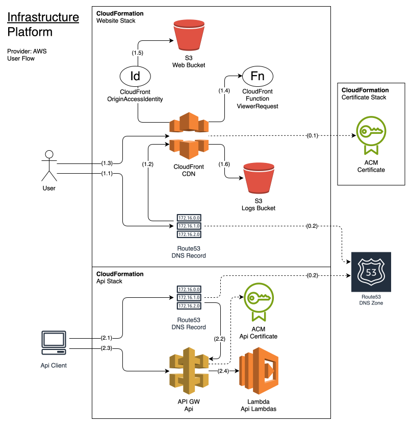
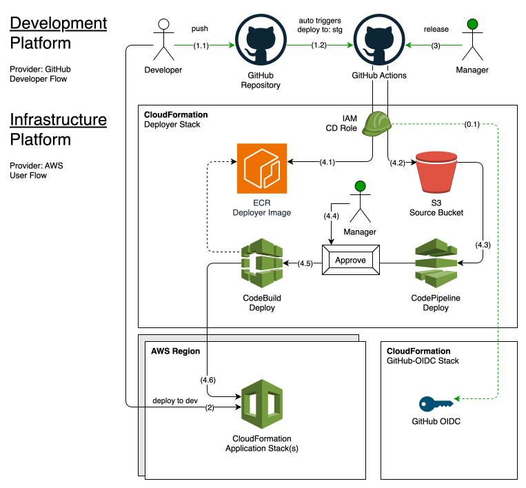

[](https://github.com/new?template_name=tpl-aws-astro-lambda&template_owner=tsertkov)

# tpl-aws-astro-lambda

A monorepo template for an AWS-hosted, Astro-generated static website with an API in AWS Lambda, complete with infrastructure code, CI/CD automations, multiple environments, and optional basic auth protection.

💲 >= **$0.55** 🌟 Monthly AWS cost (**🌐 DNS Zone** + **ECR** + 🔧 *usage*)

## Table of Contents

- [Infrastructure and Flow Diagrams](#infrastructure-and-flow-diagram)
  - [App Infrastructure](#app-infrastructure)
  - [Deployer Infrastructure](#deployer-infrastructure)
- [Monorepo Layout](#monorepo-layout)
- [Installation](#installation)
- [Usage](#usage)
- [License](#license)

## Infrastructure and Flow Diagrams

### App Infrastructure

A high-level App infrastructure diagram illustrating service integrations and user flows.



### Deployer Infrastructure

A high-level Deployer infrastructure diagram illustrating service integrations and developer flows.



Learn more infrastructure details from [the documentation](docs/infrastructure.md).

## Monorepo Layout

- [`website/`](/fe) - Frontend project
- [`api/`](/be) - Backend API project
- [`infra/`](/infra) - Common Infrastructure project
- [`deployer/`](/deployer) - Cloud deployer project
- [`e2etest/`](/e2etest) - End2end test project
- [`apitest/`](/apitest) - API test project
- [`config.json`](/config.json) - Config file
- [`Makefile`](/Makefile) - Task automations

Learn more about monorepo architecture from [the documentation](docs/monorepo.md).

## Installation

1. [Start new repository](https://github.com/new?template_name=tpl-aws-website&template_owner=tsertkov) from this template.
2. Update config.json as necessary.
3. [Deploy infrastructure](#deploy-infrastructure).
4. [Setup CI/CD](#setup-cicd).
4. Edit `fe/src` files, `git add`, `git commit`, `git push`, etc.
5. Validate `stg` deployment and run `: release` workflow.

### Deploy infrastructure

Start with deploying AWS shared resources and deploy infrastructure for `stg` and `prd` environments.

```sh
make infra-deploy-certificate
make infra-deploy-github-oidc
make deployer-infra ENV=stg
make api-build ENV=stg VERSION=local
make api-deploy ENV=stg
make website-infra-deploy ENV=stg
make website-fe-build ENV=stg
make website-fe-deploy ENV=stg
```

Update `s3bucket` and `cloudfrontId` in `config.json` with values returned in stack outputs.

### Setup CI/CD

To enable the deployment workflow, configure the following Environments and Environment Variables in your GitHub repository settings:

- **Environments:**
  - `prd` - Production
  - `stg` - Staging
- **Environment variables:**
  - `AWS_REGION` - AWS region environment is deployed to
  - `AWS_ROLE` - AWS CI/CD Role ARN
  - `SOURCE_BUCKET` - S3 bucket for deployment packages

Use `CICDRoleArn` and `SourceBucket` values from `make deployer-infra` outputs to update `AWS_ROLE` and `SOURCE_BUCKET` environment variables for a corresponding environment in repository settings.

## Usage

Use `make` to run tasks in this project:

```sh
make
# Available targets:
#   api-% - API targets
#   infra-% - Infra targets
#   website-% - Website targets
#   e2etest-% - E2Etest targets
#   apitest-% - APItest targets
#   deployer-% - Deployer targets

make infra
# Available targets:
#  deploy-certificate - deploy ACM certificate
#  deploy-github-oidc - deploy GitHub OIDC
#  test - test infrastructure templates

make deployer
# Available targets:
#   image - build deployer image
#   infra - deploy infrastructure
#   infra-lint - lint infrastructure templates

make website
# Available targets:
#   fe-% - Frontend targets
#   infra-% - Infrastructure targets

make website-fe
# Available targets:
#   build - build frontend
#   deploy - deploy frontend
#   init - init dependencies
#   init-test - init test dependencies
#   test - run tests
#   npm-run-% - run any npm script
#   npm-% - run any npm command

make website-infra
# Available targets:
#   test - test infrastructure templates
#   deploy - deploy infrastructure

make api
# Available targets:
#   init - init dependencies
#   test - test api and infrastructure
#   build - build api lambdas
#   package - package api and infrastructure
#   deploy - deploy packaged api and infrastructure

make apitest
# Available targets:
#   run - run api tests
#   init - init dependencies
#   init-test - init test dependencies
#   test - run tests
#   npm-run-% - run any npm script
#   npm-% - run any npm command

make e2etest
# Available targets:
#   run - run e2e tests
#   init - init dependencies
#   init-test - init test dependencies
#   test - run tests
#   npm-run-% - run any npm script
#   npm-% - run any npm command
```

## License

This project is licensed under the MIT License - see the [LICENSE](LICENSE) file for details.
