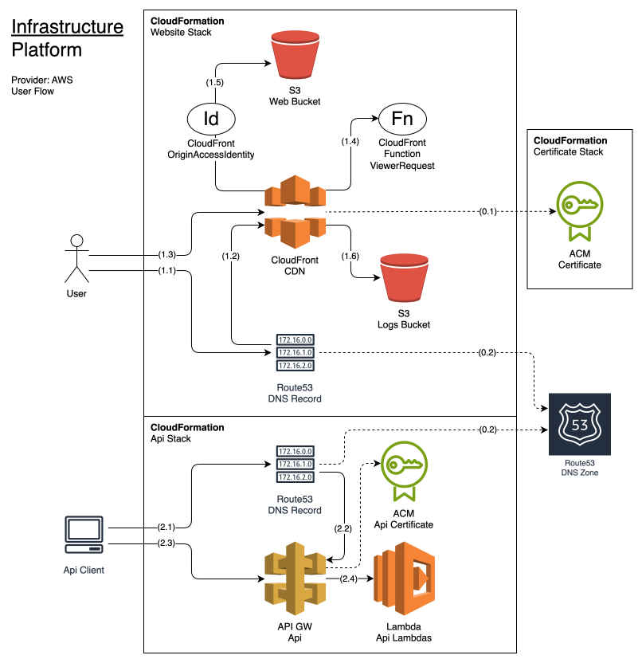
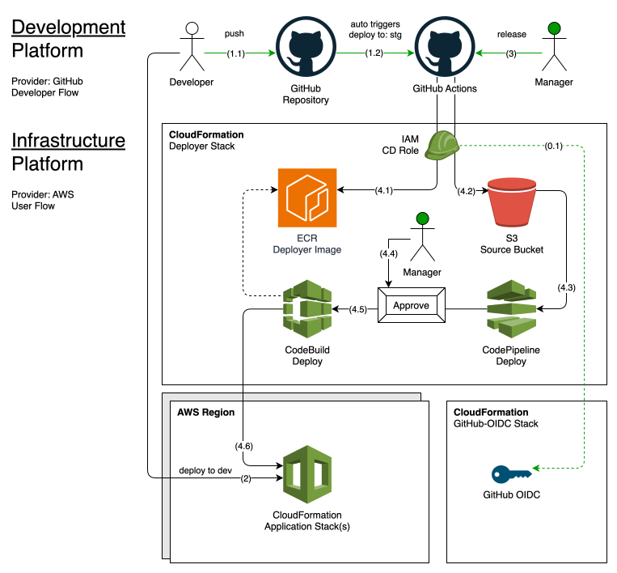

# Infrastructure and Flow Diagrams

## Table of Contents

- [App Infrastructure](#app-infrastructure)
  - [1. User Flow](#1-user-flow)
  - [2. User API Flow](#2-user-api-flow)
  - [0. Shared Resources](#0-shared-resources)
- [Deployer Infrastructure](#deployer-infrastructure)
  - [1. Developer Regular Flow](#1-developer-regular-flow)
  - [2. Developer Dev Flow](#2-developer-dev-flow)
  - [3. Release Flow](#3-release-flow)
  - [4. Continuous Deployment Flow](#4-continuous-deployment-flow)
  - [0. Shared Resources](#0-shared-resources-1)

## App Infrastructure

A high-level infrastructure diagram illustrating service integrations and user flows.

## 1. User Flow

1. User requests an IP address for a DNS name.
2. Route53 resolves the IP address from an alias record for the CloudFront distribution.
3. User sends an HTTP request to CloudFront using the resolved IP address.
4. CloudFront calls ViewerRequestFunction handling auth and basic redirects for static site urls.
5. CloudFront forwards request to upstream S3 Web Bucket if requested file is not found in the cache.
6. CloudFront logs request to S3 Logs Bucket.

## 2. User API Flow

1. User requests and IP address for a Api DNS name.
2. Route53 resolves the IP address from an alias record for the API Gateway.
3. User sends an HTTP request to API Gateway using the resolved IP address.
4. API Gateway forwards the request to the Lambda function.

## 0. Shared Resources

1. ACM certificate for CloudFront.
2. Route53 DNS zone for creating DNS records.

## Deployer Infrastructure

## 1. Developer Regular Flow

1. Developer pushes updates to a GitHub repository.
2. GitHub Actions triggers the `: deploy` workflow when code update conditions are met.

## 2. Developer Dev Flow

1. Developer builds code locally and deploys it to `dev` environment using the `make` commands.

## 3. Release Flow

1. Manager triggers the `: release` workflow to create the latest release and deploy it to the production environment.

## 4. Continuous Deployment Flow

1. _[Conditional]_ GitHub Actions release Deployer image to ECR if its code was updated.
2. GitHub Actions uploads release package to S3 Source Bucket.
3. CodePipeline detects the new release package and triggers the deployment pipeline.
4. _[Conditional]_ CodePipeline waits for the deployment approval (`prd` environment only).
5. CodePipeline runs CodeBuild Deploy project.
6. CodeDeploy deploys the release package to the target environments.

## 0. Shared Resources

1. IAM OIDCProvider for GitHub.
